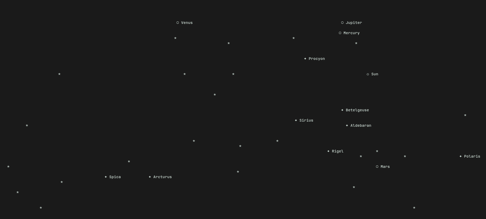

# ⭐ Starski

A real time terminal program which shoes the location of the stars in the sky at that location (very cool project)
---

## Features
- Displays bright background stars
- Labels important stars like Polaris, Sirius, Vega, Betelgeuse... etc
- Displays visible planets
- Sun and ☾ Moon
- Real-time positions calculated with Skyfield
- Automatically adapts to your terminal size
- Live changes

---

## Preview

---

## Installation

Clone the repository.

```bash
git clone https://github.com/YOUR_USERNAME/starski.git
cd starski
```

Create a virtual environment.

```bash
python -m venv .venv
```

Activate it.

### Linux (bash)

```bash
source .venv/bin/activate
```

### Linux (fish)

```fish
source .venv/bin/activate.fish
```

### Windows

```powershell
.venv\Scripts\activate
```

Install dependencies.

```bash
pip install pip install -r requirements.txt
```

Run Starski.

```bash
python main.py
```

---

## Usage

1) after installation open ```bash main.py``` 
2) enter any location in DMS system 
3) enter the direction in degrees (use ur phone for tha)
4) enjoy watching stars from ur terminal 

Starski will render the portion of the sky you're currently facing and continue updating in real time.

---

## Symbols

| Symbol | Meaning |
| :----: | ------- |
| ☉ | Sun |
| ☾ | Moon |
| ○ | Planet |
| ✦ | Important (named) star |
| * | Background star |

---

## Built With

- Python
- Skyfield
- NASA JPL DE421 Ephemeris
- Hipparcos Star Catalogue

---


## Why i built this 

Idk i wanted to watch the sky from my terminal 

*(I hate touching grass.)*
---

## Special thanks
special thanks to my best friend chatgpt wwho helped me by explaining skyfeild and the complex math and formatting the readme 
*only formatting*
## License

MIT